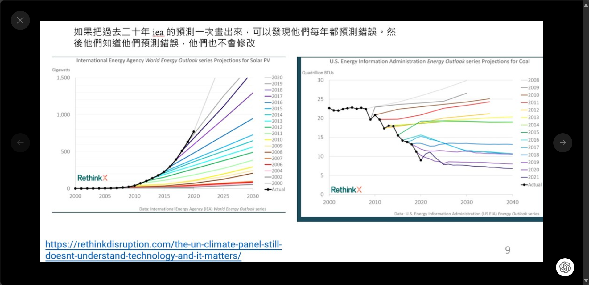

# 人不知道自己不知道

誤導社會真的是令人蠻困擾的
我覺得會這樣很大程度是因爲那些人在說那些話的時候沒有績效系統
他們說錯不會受到懲罰
還是照樣領薪水
舉例來講 在教減碳的人最喜歡引用國際能源署(IEA)的資料，但他們在太陽能的裝置容量上，每年會預測錯誤30%，連續二十年[1]，他們知道自己錯誤，但是不會改[2]
那些教ESG SDG 的人也是善良的，認真的，但他們的內容都是基於 iea 的預測，我懷疑基於這種東西而得到的結論的正確性
所以我是比較喜歡推特的社區筆記功能
，社區筆記是一個大眾，可以在每個推文下面附上注釋來糾正錯誤訊息，最起碼不小心傳遞錯誤訊息會被打臉
我期待未來會有一個 AI 系統，在人/媒體發文的時候會在下方自動查驗事實，或者貼出這個人過去說的話，就像是在對於通貨膨脹預測的新聞底下，自動貼出半年前市場的主流預測
但在學校教錯的東西，還是可以照常領薪，我是說larry summers說的經濟學家

[1]
https://www.rethinkx.com/blog/the-un-climate-panel-still-doesnt-understand-technology-and-it-matters
[2] IEA 就算知道自己一直預測錯誤，還是持續提供錯誤的預測 https://www.iea.org/reports/renewables-2022/executive-summary

