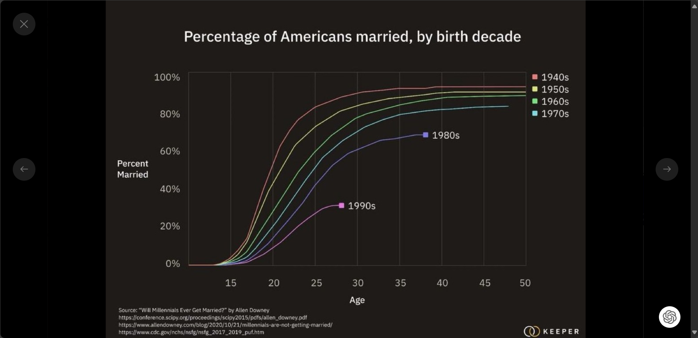

# 天生的大腦與後天的意識

最近有觀察到許多後天的自動想法其實是爲了配合先天的大腦
就像我很容易過度同理，之前常常因爲戰爭而感到很悲傷
後來我就在我的意識嵌入很多那不關我的事，他們都成年了，人類爲了理想而犧牲是一種生命的圓滿
等等很沒同理心的想法
讓最終的結果比較平靜
又或是我天生容易失眠，所以給自己定下規則每天運動
但也有發現當有了自動想法或人生有了規則
那就變成我這個人的"傳統"
老人的固執 社會的傳統似乎就是這樣來的
例如聽說當初很多社會嘗試非一夫一妻的制度後來失敗比較多
當代社會正在重新思考這個事情
老人傳統上會比較相信宗教但年輕人已經沒有那麼相信了
這是一種成熟，也是一種僵化
爲了避免思想老化
比較好的做法似乎是保持第一性原理思考或爲規矩添加失效期限
相關的圖片
1.西方文明使用小心還有進步這兩個詞的頻率，越來越多的小心，聽說文明在僵化
2.美國不同世代的結婚比例，結婚從主流變成非主流
3.美國不同世代的宗教比例
24年2月17日
文章 世界觀

