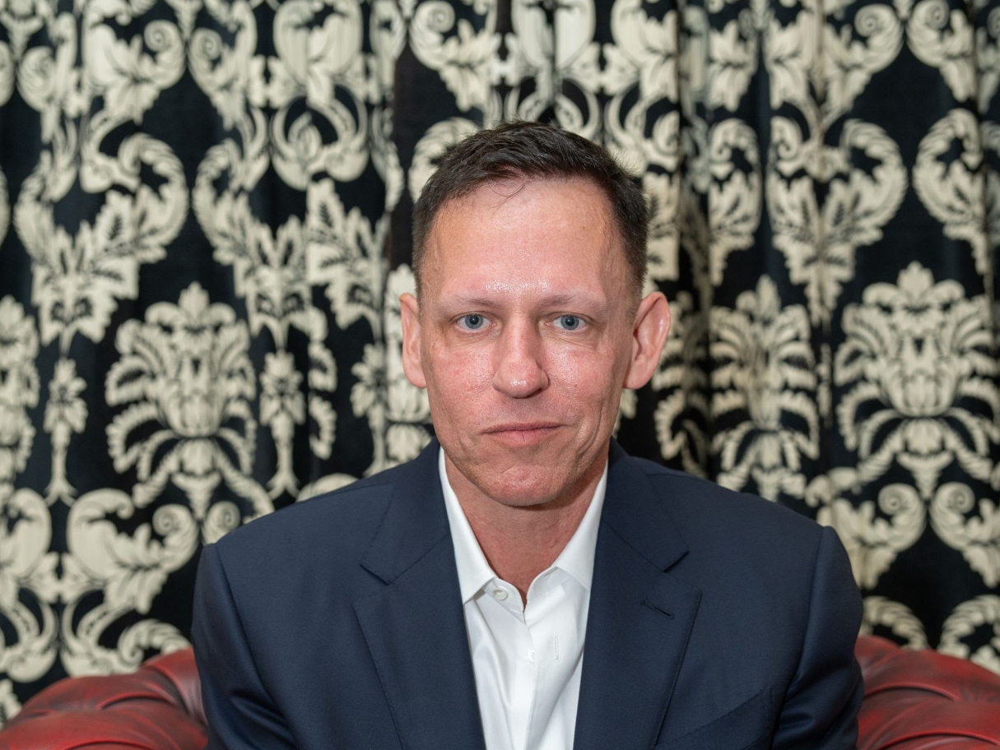

# peter thiel ，控制社會的背後影子

分享一些網絡上看到關於他的資訊
成立專門生產政府的用 AI軟體palantir，這家公司也同時生產收集情報的軍事AI，所以他是軍火商，他基本上有大量的政府資料，私人公司的 ai 會比自己自己開發的還要先進很多，某方面他是美國情報頭子
2016年 唯一挺川普的矽谷老闆
2024 共和黨副總統候選人JD vance的前老闆間現任金主
paypal founder ，政變趕走馬斯克
也是Facebook 的第一位外部投資者
現任國民黨立委許毓仁 的朋友
"他覺得未來五年中國有50%的機率會侵略台灣"
美國很明顯的會干預臺灣的政治，那他會嗎？
https://www.facebook.com/watch/?v=799157678952011

