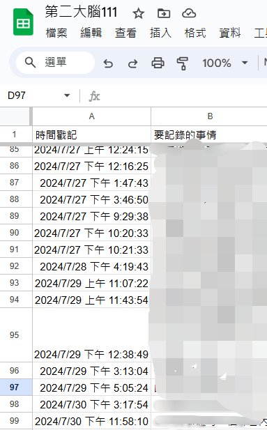

# 利用Google表單和GPT，高效記錄和分析生活中的點滴

在我們的日常生活中，總有許多瑣碎的事情需要記錄，可能是每次生病的症狀、醫生回診的建議、另一半喜歡什麼討厭什麼，甚至是一些突如其來的靈感。為了更好地管理這些資訊，我發現利用Google表單和GPT是一種非常有效的方法。

首先，我在手機的首頁增加了一個快捷按鈕，直接連接到自己的Google表單。這張表單可以設計得非常簡單，包含幾個基礎的輸入框，允許你隨時隨地記錄任何想要記下的事情。無論是生活中的重要事件，還是一些細小的感悟，都可以通過這個表單記錄下來。

隨著時間的推移，你的表單中可能會累積大量的記錄，或許多達上千條。為了更好地管理和分析這些資訊，我建議將所有記錄導入Google試算表（Google Sheets）。在試算表中，你可以輕鬆查看和整理過去的所有記錄。

然而，當數據量龐大時，查找特定記錄可能變得困難，尤其是當一些資訊非常零散，難以通過簡單的關鍵字搜尋找到。這時候，GPT就能派上用場了。你可以將所有內容複製並貼上到GPT中，提出特定的問題，例如「列出所有有關情緒變化或牙齒檢查的記錄，一字不漏地給我」，GPT能夠通過語義搜尋快速找出相關的資訊。這種方式比傳統的關鍵字搜尋更加智能和高效，使得查找和分析變得方便許多。

## 重要提示

請注意，為了保護個人隱私，不要將Google表單設置為共用。隱私設定應設為僅自己的帳號能夠打開，以確保記錄內容的安全。

### 簡單示例

例如，我有一個睡眠表單，每天記錄我的睡眠分數（1到5分）。在累積了一年之後，我請GPT幫我畫出過去一年的趨勢圖和平均線，這樣可以清晰地看到自己睡眠狀況的變化和整體趨勢。

你可以記錄一下你的日記，每天的情緒，然後最後跟 GPT 一起回顧，請他幫你總結整理。這樣的記錄和分析方式，無論是用於生活中的各種小事，還是關於健康的數據，都是一種高效且有意義的管理工具。

